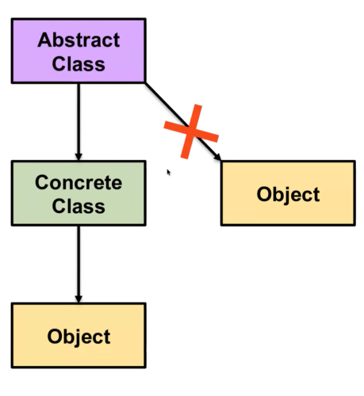

Abstract class:
- means that you cannot create an instance of this class, but you can create instances of its subclasses.
-example: 
```python
from abc import ABC, abstractmethod
class Shape(ABC):
    @abstractmethod
    def area(self):
        pass
class Circle(Shape):
    def __init__(self, radius):
        self.radius = radius
    def area(self):
        return 3.14 * self.radius ** 2
circle = Circle(5)

print(circle.area())  # Output: 78.5
``` 



Use a static method when:

The function belongs logically to the class
It does not need instance data (self)
It does not need class-level data (cls)
It is a utility/helper function related to the class
Example of a static method:
```python
class MathUtils:
    @staticmethod
    def add(a, b):
        return a + b
result = MathUtils.add(5, 3)
print(result)  # Output: 8
```